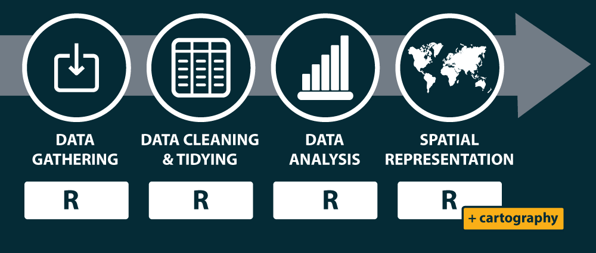

```{r knitr_init, echo=FALSE, cache=FALSE}
library(knitr)
library(rmdformats)

## Global options
options(max.print = "75")
opts_chunk$set(echo = TRUE,
	             cache = FALSE,
               prompt = FALSE,
               tidy = FALSE,
               comment = NA,
               message = FALSE,
               warning = FALSE)
opts_knit$set(width = 75)

knit_hooks$set(par = function(before, options, envir){
  if (before){
    par(mar=c(0,0,0,0))
  } 
})

knit_hooks$set(par.title = function(before, options, envir){
  if (before){
    par(mar=c(0,0,1.2,0))
  } 
})
```


# 
## Cartographie avec R


**Logiciels pour la statistique spatiale**   
RTP CNRS "Réseau Interdisciplinaire autour de la Statistique" |  *Jeudi 23 Novembre 2017*   

Timothée Giraud  
[UMS RIATE](http://riate.cnrs.fr)  
[http://rgeomatic.hypotheses.org/](http://rgeomatic.hypotheses.org/)  


# R {.tabset .tabset-fade .tabset-pills}


## 1

  


[R](https://www.r-project.org/) est un langage et un environnement permettant de réaliser une variété de **traitements statistiques** et de **représentations graphiques**.

R est un **logiciel libre** sous license GNU General Public License.

R est **multiplateforme** (GNU/Linux, Windows, OS X…).


## 2

### Un écosystème de packages  

Les extensions (*packages*) sont mis à disposition sur le [CRAN](https://cran.univ-paris1.fr/) (Comprehensive R Archive Network).

**11851** packages le 17 novembre 2017


  
<small>http://blog.revolutionanalytics.com/2017/01/cran-10000.html</small>


Les packages sont organisés en Task Views
  


La Task View "Spatial" : 	https://CRAN.R-project.org/view=Spatial


## 3

### Un environnement de développement intégré (IDE).

[RStudio](https://www.rstudio.com/) 


## 4
### Et aussi


#### Des solutions de *literate programming* ([Markdown](https://daringfireball.net/projects/markdown/syntax), [R Mardown](http://rmarkdown.rstudio.com/))

[Literate programming](https://en.wikipedia.org/wiki/Literate_programming) : Une explication de la logique du programme en langage naturel, entremêlée de morceaux de code source.

#### Des solutions de gestion de version ([git](https://fr.wikipedia.org/wiki/Git), Github)

Pour diffuser et partager ses résultats, travailler en équipe ou faire appel à des contributeurs. 


# R pour la cartographie et l'analyse spatiale ? {.tabset .tabset-fade .tabset-pills}


## Recherche reproductible {.tabset .tabset-fade .tabset-pills}

### 1
Accompagner les publications scientifiques des jeux de données et codes sources pour permettre aux collègues de reproduire les résultats.


<small>Peng, 2011</small>
</br>

### 2
Les cartes, comme les autres production graphiques ou statistiques sont des éléments à part entière des études scientifique.


## Chaînes de traitements {.tabset .tabset-fade .tabset-pills}


### 1
La grande majorité des cartes produites dans un contexte académique sont issues de processus complexes. Elles sont donc souvent produites en utilisant une grande variété de logiciels et de formats.


### 2
Cette variété de formats et de logiciels rend difficile la reproduction des cartes.


### 3
Simplifier les chaines de traitement pour couvrir les différentes étapes de la construction cartographique.




# Les fonctionnalités spatiales de R {.tabset .tabset-fade .tabset-pills}


* Import / Export
* Manipulation et affichage
* Géotraitements
* Statistiques spatiales


## Les packages "historiques"

* `rgdal` est une interface entre R et les librairies GDAL ([Geospatial Data Abstraction Library](http://www.gdal.org/)) et [PROJ4](https://github.com/OSGeo/proj.4).

* `sp` fournit des classes et des methodes pour les données spatiales dans R.

* `rgeos` donne accès à la librairie d'opérations spatiales GEOS ([Geometry Engine - Open Source](http://trac.osgeo.org/geos/)) qui permet notamment d'effectuer les géotraitements suivants :   

* Area / Perimeter 
* Distances  
* Dissolve
* Buffer
* Overlap / intersect / difference
* Contains / within
* Union
* ...


## L'actualité et le futur : le package `sf` {.tabset .tabset-fade .tabset-pills}

- Première *release* : 31 octobre 2016   
- Auteur principal et *maintainer* : [Edzer Pebesma](https://github.com/edzer)    
- Financement : <a href="https://www.r-consortium.org/projects/awarded-projects"></a>  


### Import / Export

```{r impsf, par = TRUE, cache = T}
library(sf)
nuts3 <- st_read(dsn = "data/nuts3.shp")
```


### Manipulation et affichage

```{r, par=TRUE, cache=TRUE}
plot(st_geometry(nuts3))

plot(st_geometry(nuts3), col = "#DAE3E6", border = "#8A0641", lwd = 0.5)

```


### Géotraitements

#### Agrégation des polygones / dissolve

```{r disxxsolve, par = TRUE, eval=FALSE, echo=TRUE, cache = TRUE }
europe <- st_union(x = nuts3)
plot(st_geometry(nuts3), lwd = 0.5)
plot(europe, lwd = 2, border = "red", add=T)
```

```{r x, echo = FALSE, cache = TRUE }
nuts3 <- st_buffer(x = nuts3,dist = .1)
europe <- st_union(x = nuts3)
plot(st_geometry(nuts3), col = "white", lwd = 0.5)
plot(europe, lwd = 2, border = "red", add=T)
```

#### Création de zones tampons / buffer

```{r buffxxxer, par = TRUE, cache = TRUE}
europeBuffer <- st_buffer(x = europe, dist = 50000)
plot(st_geometry(europe), col = "#92C5D6")
plot(europeBuffer, add = T, border = "red")
```


## Ressources 


**La page GitHub du *package* `sf`**

C'est dans [ce dépôt GitHub](https://github.com/edzer/sfr) que se déroule le développement du *package* et que se tiennent les [discussions](https://github.com/edzer/sfr/issues?utf8=%E2%9C%93&q=is%3Aissue%20) à son sujet.

**Les ressources publiées par Edzer Pebesma**


Le créateur et *maintainer* de `sf` a publié un certain de nombre de vignettes et de billets autour du package.

* Vignettes

    -   [Simple Features for R](https://cran.r-project.org/web/packages/sf/vignettes/sf1.html) Explication très détaillée des principes et du fonctionnement du package.
    -   [Reading, Writing and Converting Simple Features](https://cran.r-project.org/web/packages/sf/vignettes/sf2.html)
        Comment importer et exporter des objets.
    -   [Manipulating Simple Feature Geometries](https://cran.r-project.org/web/packages/sf/vignettes/sf3.html)
        Comment manipuler les objets `sf`, géotraitements, projections...  

* Billets de blog

    -   [Simple features for R](http://r-spatial.org/r/2016/02/15/simple-features-for-r.html)
    -   [Simple features for R, part 2](http://r-spatial.org/r/2016/07/18/sf2.html)
    -   [Simple features now on CRAN](http://r-spatial.org/r/2016/11/02/sfcran.html)
    -   [sf - plot, graticule, transform, units, cast, is](http://r-spatial.org/r/2017/01/12/newssf.html)


* Migration de `sp` ver `sf`
    
    [Un tableau de migration de `sp` vers `sf`](https://github.com/edzer/sfr/wiki/migrating) pour passer de l'utilisation des packages `sp`, `rgeos` et `rgdal` à l'utilisation de `sf`.


**Billets de blogs / tutoriels**

-   [Faire des cartes avec R - Introduction au package sf](https://github.com/riatelab/intro_sf) - Santiago Mora

-   [Tidy spatial data in R: using dplyr, tidyr, and ggplot2 with sf](http://strimas.com/r/tidy-sf/) - Matt Strimas-Mackey

-   [First Impressions From sf – The Simple Features R Package](https://geographicdatascience.com/2017/01/06/first-impressions-from-sf-the-simple-features-r-package/) - Geographic Data Science Lab

-   [Spatial analysis pipelines with simple features in R](https://walkerke.github.io/2016/12/spatial-pipelines/) - Kyle Walker

-   [Spatial analysis in R with the sf package](http://rhodyrstats.org/geospatial_with_sf/geospatial_with_sf.html) - rhodyRstats

-   [Landscape Ecology with R:A tutorial with raster and sf](http://jwhollister.com/r_landscape_tutorial/tutorial.html) - Jeffrey W. Hollister

-   [Mapping “France at night” with the new sf package](http://sharpsightlabs.com/blog/mapping-france-night/) - Sharp Sight Labs


# Le package cartography {.tabset .tabset-fade .tabset-pills}

*Create and integrate maps in your R workflow. This package allows various cartographic representations such as proportional symbols, chroropleth, typology, flows or discontinuities maps. It also offers several features enhancing the graphic presentation of maps like cartographic palettes, layout elements (scale, north arrow, title...), labels, legends or access to some cartographic APIs.*


## Installation 

- Version stable (CRAN)

```{r, eval = FALSE}
install.packages("cartography")
```

</br></br>

- Version de développement (Github)    
```{r, eval = FALSE}
devtools::install_github(repo = "riatelab/cartography")
```


## Cartes choroplèthes

```{r choroMap, par.title = TRUE, cache = TRUE}
library(cartography)

# chargement de données
data(nuts2006)

# Calcul du taux de croissance annuel moyen
nuts2.df$cagr <- 100 * (((nuts2.df$pop2008 / nuts2.df$pop1999)^(1/9)) - 1) 

# Cartographie
choroLayer(spdf = nuts2.spdf, df = nuts2.df, var = "cagr")
title("Taux de croissance en Europe")
```


Après ce premier jet, il est ensuite possible de paramétrer très finement la carte : palette de couleurs, discrétisation, légende, couches d'habillage...

```{r choroMap2, par.title = TRUE, cache = TRUE}
# Construire une palette de couleurs
cols <- carto.pal(pal1 = "green.pal", n1 = 2, 
                  pal2 = "red.pal", n2 = 4) 

# Affichage de couches d'habillage
plot(nuts0.spdf, border = NA, col = NA, bg = "#A6CAE0")
plot(world.spdf, col  = "#E3DEBF", border=NA, add=TRUE)

# Cartographie du taux de croissance annuel moyen
choroLayer(spdf = nuts2.spdf, df = nuts2.df, var = "cagr",
           breaks = c(-2.43,-1.0,0.0,0.5,1.0,2.0,3.1), 
           col = cols,
           border = "grey40",
           lwd = 0.5, 
           legend.pos = "right",
           legend.title.txt = "taux de croissance\nannuel moyen", 
           legend.values.rnd = 2, 
           add = TRUE) 

# Affichage de couches d'habillage
plot(nuts0.spdf,border = "grey20", lwd=0.75, add=TRUE)

# Ajout des titres, légende, sources, etc.
layoutLayer(title = "Taux de croissance en Europe", 
            author = "cartography v2.0.2", 
            sources = "Eurostat, 2008", frame = TRUE, col = NA, 
            scale = NULL,coltitle = "black",
            south = TRUE) 

```

## Cartes en symboles proportionnels

Cartographie d'un stock (la population nationale) avec des figurés proportionnels.

```{r propMap, par.title = TRUE, cache = TRUE}

# Affichage de couches d'habillage
plot(nuts0.spdf, border = NA, col = NA, bg = "#A6CAE0")
plot(world.spdf, col  = "#E3DEBF", border=NA, add=TRUE)
plot(nuts0.spdf, col = "#D1914D",border = "grey80", add=TRUE)

# Cartographie de la population des pays en cercles proportionnels
propSymbolsLayer(spdf = nuts0.spdf, df = nuts0.df,
                 var = "pop2008", 
                 symbols = "circle", col =  "seagreen4",
                 legend.pos = "right", inches = 0.35,
                 legend.title.txt = "Total\npopulation (2008)",
                 legend.style = "c")

# Ajout de labels
dflab <- nuts0.df[order(nuts0.df$pop2008, decreasing = TRUE),][1:8,]
dflab$lab <- paste(dflab$id, "\n", round(dflab$pop2008/1000000,0), "M", sep ="")

# Label plot of the 8 most populated countries
labelLayer(spdf = nuts0.spdf, 
           df = dflab, 
           txt = "lab", 
           col = "#690409", 
           cex = 0.8, 
           font = 2) 

# Ajout des titres, légende, sources, etc.
layoutLayer(title = "Countries Population in Europe",
            theme = 'green.pal',
            frame = FALSE,
            author = "cartography v2.0.2",
            sources = "Eurostat, 2008",
            scale = NULL,
            south = TRUE)
```

## Cartes en symboles proportionnels colorés

```{r psc, par.title = TRUE, cache = TRUE}
# Load data
data(nuts2006)

# Compute the compound annual growth rate
nuts2.df$cagr <- (((nuts2.df$pop2008 / nuts2.df$pop1999)^(1/9)) - 1) * 100

# Plot a layer with the extent of the EU28 countries with only a background color
plot(nuts0.spdf, border = NA, col = NA, bg = "#A6CAE0")
# Plot non european space
plot(world.spdf, col  = "#E3DEBF", border = NA, add = TRUE)
# Plot Nuts2 regions
plot(nuts2.spdf, col = "grey60",border = "white", lwd = 0.4, add = TRUE)

# Set a custom color palette
cols <- carto.pal(pal1 = "blue.pal", n1 = 2, pal2 = "red.pal", n2 = 4)

# Plot symbols with choropleth coloration
propSymbolsChoroLayer(spdf = nuts2.spdf, df = nuts2.df, 
                      var = "pop2008", inches = 0.1, 
                      var2 = "cagr", col = cols, 
                      breaks = c(-2.43,-1,0,0.5,1,2,3.1), 
                      border = "grey50", lwd = 0.75, 
                      legend.var.pos = "topright", 
                      legend.var.values.rnd = -3,
                      legend.var.title.txt = "Total Population", 
                      legend.var.style = "e", 
                      legend.var2.pos = "right", 
                      legend.var2.title.txt = "Compound Annual\nGrowth Rate") 

# layout
layoutLayer(title = "Demographic trends, 1999-2008", coltitle = "black",
            sources = "Eurostat, 2011", scale = NULL,
            author = "cartography v2.0.2", frame ="", col = NA)

```


## Cartes de flux

Il s'agit de représenter des données, agrégées à un niveau régional, sur les jumelages entre villes. 

```{r linkMap, par.title = TRUE, cache=TRUE}
# Données sur les jumelages
head(twincities.df)

# Creation d'une couche de liens
twincities.sf <- getLinkLayer(x = nuts2.spdf, df = twincities.df[,1:2])

# Affichage des liens créés
plot(st_geometry(twincities.sf), lwd = 0.2)

# Affichage de couches d'habillage
plot(nuts0.spdf, border = NA, col = NA, bg = "#A6CAE0")
plot(world.spdf, col  = "#E3DEBF", border=NA, add=TRUE)
plot(nuts2.spdf, col = "#D1914D",border = "grey80", add=TRUE)

# Cartographie des liens
gradLinkLayer(x = twincities.sf, df = twincities.df,   
              var = "fij", 
              breaks = c(2,5,15,20,30), 
              lwd = c(0.1,1,4,10), 
              col = "#92000090",
              legend.pos = "right", legend.frame = TRUE,
              legend.title.txt = "Number of Agreements\n(regional level)",
              add = TRUE)

# Ajout des titres, légende, sources, etc.
layoutLayer(title = "International Twinning Agreements Between Cities", 
            author = "cartography v2.0.2", 
            sources = "Sources: Adam Ploszaj & Wikipedia, 2011",
            scale = NULL, south = TRUE, frame = TRUE, col = NA, 
            coltitle = "black")
```


## Discontinuités

```{r discLayer, cache=TRUE, par.title=TRUE}
library(cartography)

# Load data
data(nuts2006)

# Get a layer of borders between regions of countries borders
nuts2.contig <- getBorders(nuts2.spdf)

plot(nuts2.spdf, col = "grey", border = NA)
plot(st_geometry(nuts2.contig), col = 1:5, add=T, lwd = 3)

# get gdp/inhabitants
nuts2.df$gdpcap <- nuts2.df$gdppps2008/nuts2.df$pop2008 * 1e+06

# Plot a background layers
plot(nuts2.spdf, border = NA, col = NA, bg = "#A6CAE0")
plot(world.spdf, col = "#E3DEBF", border = NA, add = TRUE)

# Plot GDP per capita with a choropleth layer
choroLayer(spdf = nuts2.spdf, df = nuts2.df, var = "gdpcap", 
           border = "grey20", lwd = 0.2, 
           col = carto.pal(pal1 = "green.pal", n1 = 3, "sand.pal", 3), 
           method = "quantile", nclass = 6, add = TRUE, 
           legend.pos = "right", legend.values.rnd = -2, 
           legend.title.txt = "GDP per Capita\n(in euros)")

# Plot discontinuities
discLayer(x = nuts2.contig, df = nuts2.df, 
          var = "gdpcap", type = "rel", 
          method = "equal", nclass = 3, threshold = 0.4, 
          sizemin = 0.7, sizemax = 6, col = "red", 
          legend.values.rnd = 1, legend.pos = "topright", add = TRUE,
          legend.title.txt = 
            "Discontinuities in \nGDP per Capita\n(relative)")

# Layout
layoutLayer(title = "Wealth Disparities in Europe, 2008", 
            author = "cartography v2.0.2", 
            sources = "Source: Eurostat, 2011", frame = TRUE, 
            scale = 500, north = FALSE, theme = "grey.pal")

```


## Carroyages

```{r gridLayer, par.title=TRUE, cache=TRUE}
library(cartography)
# Load data
data(nuts2006)

nuts3.spdf@data <- nuts3.df

# Create a grid layer
mygrid <- getGridLayer(x = nuts3.spdf, 
                       cellsize = 100000 * 100000, 
                       var = c("pop2008", "pop1999"), 
                       type = "hexagonal")

# Compute the compound annual growth rate
mygrid$cagr <- (((mygrid$pop2008/mygrid$pop1999)^(1/9)) - 1) * 100
v <- getBreaks(v = mygrid$cagr, method = "quantile", nclass = 10)
v[5] <- 0

# set a color palette
cols <- c("#f18b61", "#f7b48c", "#f3d9b7", "#f1eccd", 
          "#c0dec2", "#91caa4", "#63b285", "#329966", 
          "#26734d", "#1a4c33")

# Plot a background layers
plot(nuts0.spdf, border = NA, col = NA, bg = "#A6CAE0")
plot(world.spdf, col = "#CCCCCC", border = NA, add = TRUE)

# plot the choropleth grid
choroLayer(x = mygrid, var = "cagr", add = TRUE, 
           col = cols, lwd = 0.6, border = "#FFFFFF60", 
           legend.pos = "right", breaks = v, legend.values.rnd = 2, 
           legend.title.txt = "Compound Annual\nGrowth Rate")

# plot countries boundaries
plot(nuts0.spdf, add = T, col = NA, border = "#56514c", lwd = 0.7)

# Plot a layout
layoutLayer(title = "Demographic Trends, 1999-2008", 
            author = "cartography v2.0.2", 
            sources = "Source: Eurostat, 2011", frame = TRUE, 
            scale = 500, north = TRUE, theme = "taupe.pal")
```


## Cartes lissées

```{r lissmap, echo = TRUE, eval = TRUE, cache=TRUE, message=FALSE, par.title=TRUE, warning=FALSE }
# Load data
data(nuts2006)

nuts3.spdf@data = nuts3.df
# Create a grid layer
mygrid <- getGridLayer(x = sf::st_as_sf(nuts3.spdf), 
                       cellsize = 50000 * 50000, 
                       type = "regular", 
                       var = c("pop2008", "gdppps2008"))


# Compute data for the grid layer
mygrid$gdp <- mygrid$gdppps2008*1000000

# list of breaks
v <- c(2920, 5000, 10000, 15000, 20000, 23500, 30000, 35000, 40000, 42720)
# Plot a layer with the extent of the EU28 countries with only a background
# color
plot(nuts0.spdf, border = NA, col = NA, bg = "#A6CAE0")

# Plot non european space
plot(world.spdf, col = "#E3DEBF", border = NA, add = TRUE)

# set a color palette
cols <- c(rev(carto.pal("green.pal", 5)), carto.pal("orange.pal", 4))

# compute & display the potential map
smoothLayer(x = mygrid, var = "gdp", var2 = "pop2008", 
            breaks = v, span = 1e+05, beta = 2, mask = nuts0.spdf, 
            resolution = 49000, col = cols, 
            legend.title.txt = "Potential\nGDP per capita\n(in euros)", 
            legend.values.rnd = -2, 
            border = "grey80", lwd = 0.5, add = T, 
            legend.pos = "topright")

# plot Europe contour
plot(rgeos::gBuffer(nuts0.spdf, FALSE, 1), 
     add = T, col = NA, border = "grey50")

# plot a layout
layoutLayer(title = "Wealth Inequalities in Europe, 2008", 
            author = "cartography v2.0.2", 
            sources = "Source: Eurostat, 2011", 
            frame = TRUE, scale = 500, north = FALSE, 
            theme = "sand.pal")

# plot a text on the map
text(x = 6271272, y = 3743765, labels = "Distance function:\n- type = exponential\n- beta = 2\n- span = 100 km", 
     cex = 0.8, adj = 0, font = 3)

```


## Ressources

**La page GitHub du *package* `cartography`**

C'est dans [ce dépôt GitHub](https://github.com/Groupe-ElementR/cartography) que se déroule le développement du *package* et que se tiennent les [discussions](https://github.com/Groupe-ElementR/cartography/issues) à son sujet.


**Billets de blogs, tutoriels, présentations**


[Giraud, T. and Lambert, N. (2017). “Reproducible Cartography.” In Peterson MP (ed.), _Advances in Cartography and GIScience. ICACI 2017. Lecture Notes in Geoinformation and Cartography._, pp.
173-183. doi: 10.1007/978-3-319-57336-6_13.](https://github.com/riatelab/ReproducibleCartography)  (EN)    

[New version of the cartography package](https://rgeomatic.hypotheses.org/1205) (EN)     
[Demo codes in the R graph Gallery](http://www.r-graph-gallery.com/portfolio/maps/) (EN)    
[Create and integrate maps in your R workflow with the cartography package](http://rgeomatic.hypotheses.org/842) (EN)  
[SF & cartography V2.0.0](https://rgeomatic.hypotheses.org/1149) (FR)  
[De superbes cartes thématiques...](http://rgeomatic.hypotheses.org/1086) (FR)  
[Le package cartography a un an](http://rgeomatic.hypotheses.org/1016) (FR)    
[Cartographie avec R : le package cartography](http://rgeomatic.hypotheses.org/659) (FR)  
[R pour les cartographes](http://neocarto.hypotheses.org/1859) (FR)    
[Comment faire un carton avec R?](http://rgeomatic.hypotheses.org/category/cartography) (FR - *How to build inset maps*)  
[Tutoriel - Cartographie avec R](http://wukan.ums-riate.fr/r2016/) (FR)  
[Cartographie et traitement de l’information géographique avec R](http://wukan.ums-riate.fr/RUSS/RUSS_2016/) (FR)  
[R pour les cartographes : le package cartography](https://osgeo-fr.github.io/presentations_foss4gfr/2016/J1/R_Cartography_T_Giraud_FOSS4G-fr-2016/FOSS4G-fr-2016.html) (FR)


Le blog [http://rgeomatic.hypotheses.org/](http://rgeomatic.hypotheses.org/)


# Exemples

1. [Villes](https://rcarto.github.io/Intro_a_la_carto_avec_R/ex/ville.html)

2. [OpenStreetMap](https://rcarto.github.io/caRtosm/index.html)


#   


La présentation est accessible à cette adresse :     </br> **[https://rcarto.github.io/Intro_a_la_carto_avec_R/index.html](https://rcarto.github.io/Intro_a_la_carto_avec_R/index.html)**  

Son code source est accessible sur [GitHub](https://github.com/rCarto/Intro_a_la_carto_avec_R).  


`cartography`  
Github: https://github.com/riatelab/cartography  
CRAN: https://cran.r-project.org/web/packages/cartography/   

rgeomatic  
https://rgeomatic.hypotheses.org
 


```{r}
sessionInfo()
```


